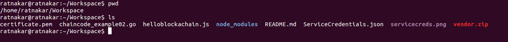

#How to use hfc with the IBM Bluemix Blockchain beta service

The goal is to run [helloblockchain.js](https://github.com/ratnakar-asara/Node-Sample/blob/master/helloblockchain.js) sample program, which will deploy example02 chaincode and query/invoke it.

1. Install npm, instructions are [here](http://blog.npmjs.org/post/85484771375/how-to-install-npm)

1. Create a directory (Workspace) folder where you will place the helloblockchain.js source code and node modules.  For example, `mkdir -p $HOME/Workspace`

1. Go to Workspace folder and Install hfc v0.5.3 with the below command:

	```
	cd $HOME/Workspace
	npm install hfc@0.5.4
	```

1. Create a Bluemix account, login and using the Catlog and select the Blockchain service.  Once in the service select either a `Starter Developer plan` or `High Security Business Network plan` (if authorized).  Now, click on `CREATE` and get the `Service Credentials` for the service.   Cut and Paste this json file and save it  as ServiceCredentials.json  in your local directory where [helloblockchain.js](https://github.com/IBM-Blockchain/SDK-Demo/blob/master/helloblockchain.js)
	- Refer the sample file in repo [here](https://github.com/IBM-Blockchain/SDK-Demo/blob/master/ServiceCredentials.json)

     

1. Download [helloblockchain.js](https://github.com/IBM-Blockchain/SDK-Demo/blob/master/helloblockchain.js) and save it your Workspace folder.
   It looks something like below:

   

1.  The node sdk will create the keyValStore directory and store cryptography data for each user that registers.

1. Create chaincode folder under your $GOPATH.
	- `mkdir -p $GOPATH/src/chaincode_example02`
	- copy chaincode file [chaincode_example02.go](https://github.com/IBM-Blockchain/SDK-Demo/blob/master/chaincode_example02.go) to folder `$GOPATH/src/chaincode_example02`.

1. Download [vendor.zip](https://github.com/IBM-Blockchain/SDK-Demo/blob/master/vendor.zip) and similarly copy to the same folder - `$GOPATH/src/chaincode_example02` and **unzip**
	- delete `vendor.zip`

1. From Workspace folder run node program:
	```
	node helloblockchain.js -c chaincode_example02
	```
	**To enable debug logs :**
	```
	DEBUG=hfc node helloblockchain.js -c chaincode_example02
	```

	**To enable grpc traces:**
	```
	GRPC_TRACE=all DEBUG=hfc node helloblockchain.js -c chaincode_example02
	```

Once Deploy/Invoke and Query are successful, we should see the below messages:

```
Successfully deployed chaincode: request={"fcn":"init","args":["a","100","b","200"],"certificatePath":"/certs/blockchain-cert.pem","chaincodePath":"chaincode_example02"}, response={"uuid":"2d6ad8d6-1390-4c60-a01b-f4c301175eb7","chaincodeID":"9be0a0ed3f1788e8728c8911c747d2f6d0e205fa63422dc598d498fe709b9b8d","result":"TODO: get actual results; waited 120 seconds and assumed deploy was successful"}

Successfully submitted chaincode invoke transaction: request={"chaincodeID":"9be0a0ed3f1788e8728c8911c747d2f6d0e205fa63422dc598d498fe709b9b8d","fcn":"invoke","args":["a","b","1"]}, response={"uuid":"f9a902d2-44d8-4b68-b43d-419470ba73ae"}

Successfully completed chaincode invoke transaction: request={"chaincodeID":"9be0a0ed3f1788e8728c8911c747d2f6d0e205fa63422dc598d498fe709b9b8d","fcn":"invoke","args":["a","b","1"]}, response={"result":"waited 20 seconds and assumed invoke was successful"}

Successfully queried  chaincode function: request={"chaincodeID":"9be0a0ed3f1788e8728c8911c747d2f6d0e205fa63422dc598d498fe709b9b8d","fcn":"query","args":["a"]}, value=99
```

***

#Troubleshoot
- Make sure you have `hfc@0.5.3` with either of the below commands from your workspace dir
  * npm list | grep hfc
  * npm list -g | grep hfc  # If installed using -g flag
- if you get query failure error as below. 

  ```
Failed to query chaincode, function: request={"chaincodeID":"9be0a0ed3f1788e8728c8911c747d2f6d0e205fa63422dc598d498fe709b9b8d","fcn":"query","args":["a"]}, error={"error":{"status":"FAILURE","msg":{"type":"Buffer","data":[69,114,114,111,114,58,70,97,105,108,101,100,32,116,111,32,108,97,117,110,99,104,32,99,104,97,105,110,99,111,100,101,32,115,112,101,99,40,112,114,101,109,97,116,117,114,101,32,101,120,101,99,117,116,105,111,110,32,45,32,99,104,97,105,110,99,111,100,101,32,40,57,98,101,48,97,48,101,100,51,102,49,55,56,56,101,56,55,50,56,99,56,57,49,49,99,55,52,55,100,50,102,54,100,48,101,50,48,53,102,97,54,51,52,50,50,100,99,53,57,56,100,52,57,56,102,101,55,48,57,98,57,98,56,100,41,32,105,115,32,98,101,105,110,103,32,108,97,117,110,99,104,101,100,41]}},"msg":"Error:Failed to launch chaincode spec(premature execution - chaincode (9be0a0ed3f1788e8728c8911c747d2f6d0e205fa63422dc598d498fe709b9b8d) is being launched)"}
  ```

  increase deploy wait time
  ex: `chain.setDeployWaitTime(80);`

- if you get a handshake error, try a different `grpc` version
  * You can get the version details by issuing either of the below commands
    - `npm list | grep grpc`
    - `npm list -g | grep grpc`
