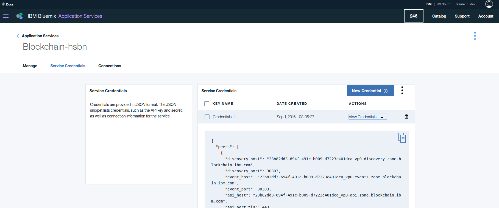

#How to use hfc with Bluemix networks

The goal is to run [helloblockchain.js](https://github.com/ratnakar-asara/Node-Sample/blob/master/helloblockachain.js) sample program, which will deploy example02 chaincode and query/invoke it.

1. Install npm, instructions are [here](http://blog.npmjs.org/post/85484771375/how-to-install-npm)

1. Install hfc v0.5.0:

	```
	> npm install hfc@0.5.0
	```

1. Get the Service credentials from Buemix account and save as ServiceCredentials.json 
	- Refer the sample file in [repo](https://github.com/ratnakar-asara/Node-Sample/blob/master/ServiceCredentials.json)
     
1. Browse to `./node_modules/hfc` (this will be referred to as the "root" of the hfc module)

1. Open `helloblockchain.js` and look for what you are setting as the "key value store" ie `chain.setKeyValStore(hfc.newFileKeyValStore('/tmp/keyValStore'));`
	1. Find your key value store locally and make sure the path to the folder exists
		- (in windows default is) C:\tmp\keyValStore
	1. Also delete anything in this `keyValStore` folder (you should empty this out anytime you connect to a new network or switch users) 

1. If you are using HSBN Network, make sure you have set the environmental variable `GRPC_SSL_CIPHER_SUITES`
`
process.env['GRPC_SSL_CIPHER_SUITES'] = 'ECDHE-RSA-AES128-GCM-SHA256:ECDHE-RSA-AES128-SHA256:ECDHE-RSA-AES256-SHA384:ECDHE-RSA-AES256-GCM-SHA384';
`

1. Create `$GOPATH/src/github.com/chaincode_example02` folderGRPC_SSL_CIPHER_SUITES
	- copy `chaincode_example02.go` from [here](https://github.com/hyperledger/fabric/blob/master/examples/chaincode/go/chaincode_example02/chaincode_example02.go)

1. Copy the `vendor.7z` file from this repo  to `$GOPATH/src/github.com/chaincode_example02` and **unzip**
	- delete `vendor.7z`

1. From root of hfc module run:
	
```
	> set DEBUG=hfc
	> node helloblockchain.js -c $GOPATH/go/src/github.com/chaincode_example02
```
Success looks like:

```
Successfully deployed chaincode: request={"fcn":"init","args":["a","100","b","200"],"certificatePath":"/certs/blockchain-cert.pem","chaincodePath":"github.com/chaincode_example02/"}, response={"uuid":"2d6ad8d6-1390-4c60-a01b-f4c301175eb7","chaincodeID":"9be0a0ed3f1788e8728c8911c747d2f6d0e205fa63422dc598d498fe709b9b8d","result":"TODO: get actual results; waited 120 seconds and assumed deploy was successful"}

Successfully submitted chaincode invoke transaction: request={"chaincodeID":"9be0a0ed3f1788e8728c8911c747d2f6d0e205fa63422dc598d498fe709b9b8d","fcn":"invoke","args":["a","b","1"]}, response={"uuid":"f9a902d2-44d8-4b68-b43d-419470ba73ae"}

Successfully completed chaincode invoke transaction: request={"chaincodeID":"9be0a0ed3f1788e8728c8911c747d2f6d0e205fa63422dc598d498fe709b9b8d","fcn":"invoke","args":["a","b","1"]}, response={"result":"waited 20 seconds and assumed invoke was successful"}

Successfully queried  chaincode function: request={"chaincodeID":"9be0a0ed3f1788e8728c8911c747d2f6d0e205fa63422dc598d498fe709b9b8d","fcn":"query","args":["a"]}, value=99
```

***

#Troubleshoot
- if you get query failure error as below. 

  ```
Failed to query chaincode, function: request={"chaincodeID":"9be0a0ed3f1788e8728c8911c747d2f6d0e205fa63422dc598d498fe709b9b8d","fcn":"query","args":["a"]}, error={"error":{"status":"FAILURE","msg":{"type":"Buffer","data":[69,114,114,111,114,58,70,97,105,108,101,100,32,116,111,32,108,97,117,110,99,104,32,99,104,97,105,110,99,111,100,101,32,115,112,101,99,40,112,114,101,109,97,116,117,114,101,32,101,120,101,99,117,116,105,111,110,32,45,32,99,104,97,105,110,99,111,100,101,32,40,57,98,101,48,97,48,101,100,51,102,49,55,56,56,101,56,55,50,56,99,56,57,49,49,99,55,52,55,100,50,102,54,100,48,101,50,48,53,102,97,54,51,52,50,50,100,99,53,57,56,100,52,57,56,102,101,55,48,57,98,57,98,56,100,41,32,105,115,32,98,101,105,110,103,32,108,97,117,110,99,104,101,100,41]}},"msg":"Error:Failed to launch chaincode spec(premature execution - chaincode (9be0a0ed3f1788e8728c8911c747d2f6d0e205fa63422dc598d498fe709b9b8d) is being launched)"}
  ```

  increase deploy wait time

`chain.setDeployWaitTime(80);`

- if you get a handshake error, try a different `grpc` version
- if you cannot npm install the hfc module, remove sleep dependency in package.json and delete node_modules/sleep if it exists

